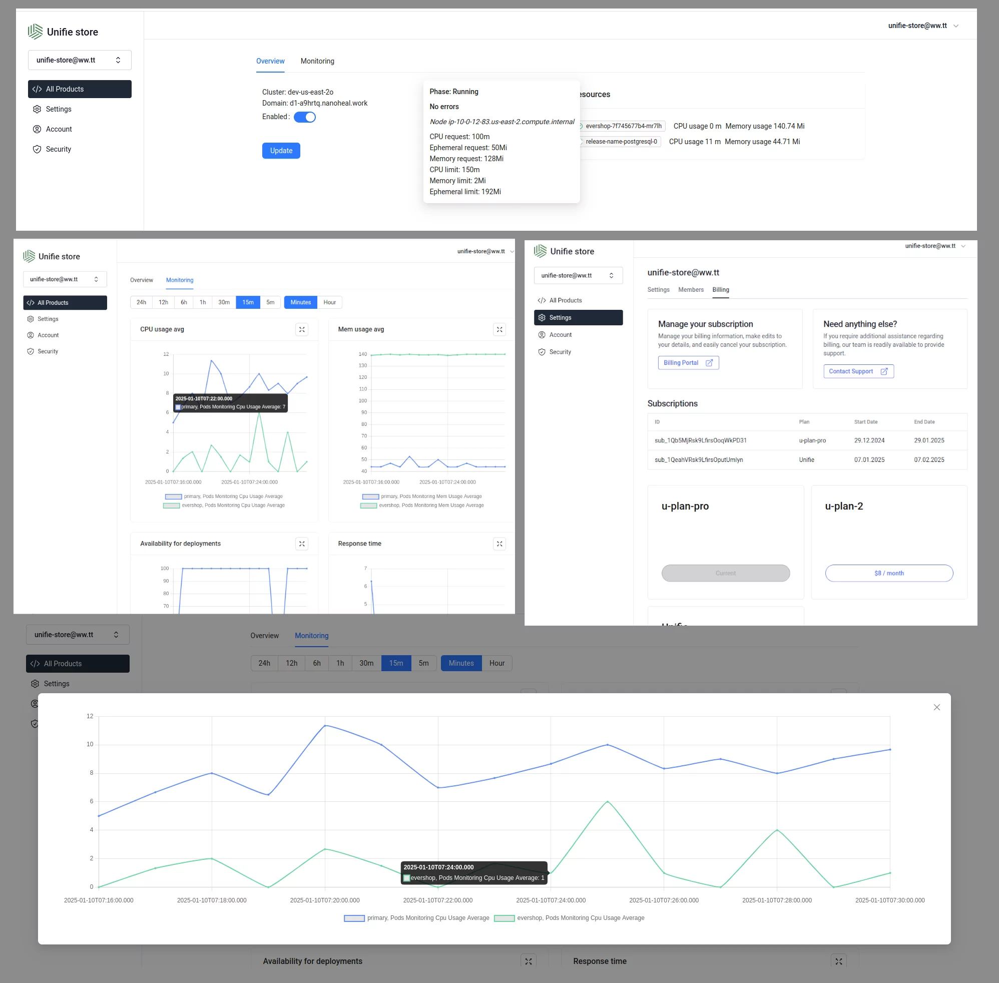

<picture>
  <source media="(prefers-color-scheme: dark)" srcset="https://avatars.githubusercontent.com/u/164479931?s=256&v=4">
  <source media="(prefers-color-scheme: light)" srcset="https://avatars.githubusercontent.com/u/164479931?s=256&v=4">
  
</picture>

# ⭐ Simplest way to get SaaS cloud with own UI and business logic for your software.

<p>
    <a href="https://github.com/unifie-cloud/u-store/stargazers"></a>
    <a href="https://github.com/unifie-cloud/u-store/issues"></a>
    <a href="https://github.com/unifie-cloud/u-store/blob/main/LICENSE"></a>
</p>

This project allow to build cloud SaaS platform from any software to drive more usage, unlock more revenue and grow faster.

Please star ⭐ the repo if you want us to continue with unifie-store! 😀

## UI

- [Demo store](https://store.nanoheal.work)
- Login: `unifie-store@ww.tt`
- Password: `unifie-store@ww.tt`



# ✨ Getting Started

1. [Create template for your own software](https://www.unifie.cloud/doc/docs/User-Guide/templates/)
1. Pass your template id to ENV var

- [AWS ECR image registry](https://gallery.ecr.aws/g4a0y2u8/unifie-store)

# One click deploy

[](https://unifie.cloud/kubernetes/unifie-project-lf24rvjgzu9rwhd5)

## 🛠️ Built With

- [Unifie.cloud](https://www.unifie.cloud/doc/docs/Overview/)
  streamlines application deployment to your own cloud account, empowering you with the flexibility and scalability you need to thrive.

  This project use unifie.cloud API to mange deployments in kubernetes clusters.

- [Next.js](https://nextjs.org)
  This is a React framework that provides features such as server-side rendering and static site generation. It's used for building the user interface of your application. The main configuration for Next.js can be found in next.config.js.
- [GraphQL Apollo Server](https://www.apollographql.com/docs/apollo-server)
  Is a query language and server-side runtime for application programming interfaces (APIs) that gives API clients exactly the data they requested.
- [Ant Design](https://ant.design/)
  Ant Design is a comprehensive design system that includes a complete set of React components. Since React is component-based, it's pretty easy to use Ant Design's React components as building blocks to quickly put together a prototype
- [Tailwind CSS](https://tailwindcss.com)
  This is a utility-first CSS framework for rapidly building custom user interfaces. It's used for styling the application. The configuration for Tailwind CSS can be found in postcss.config.js.
- [Postgres](https://www.postgresql.org)
  This is a powerful, open source object-relational database system. It's used for storing application data. The connection to Postgres is likely managed through Prisma.
- [React](https://reactjs.org)
  This is a JavaScript library for building user interfaces. It's used for creating the interactive elements of your application. The React components are located in the components directory.
- [Prisma](https://www.prisma.io)
  This is an open-source database toolkit. It's used for object-relational mapping, which simplifies the process of writing database queries. Prisma configuration and schema can be found in the prisma directory.
- [TypeScript](https://www.typescriptlang.org)
  This is a typed superset of JavaScript that compiles to plain JavaScript. It's used to make the code more robust and maintainable. TypeScript definitions and configurations can be found in files like next-env.d.ts and i18next.d.ts.
- [SAML Jackson](https://github.com/boxyhq/jackson) (Provides SAML SSO, Directory Sync)
  This is a service for handling SAML SSO (Single Sign-On). It's used to allow users to sign in with a single ID and password to any of several related systems i.e (using a single set of credentials). The implementation of SAML Jackson is primarily located within the files associated with authentication.
- [Svix](https://www.svix.com/) (Provides Webhook Orchestration)
  This is a service for handling webhooks. It's used to emit events on user/team CRUD operations, which can then be caught and handled by other parts of the application or external services. The integration of Svix is distributed throughout the codebase, primarily in areas where Create, Read, Update, and Delete (CRUD) operations are executed.
- [Retraced](https://github.com/retracedhq/retraced) (Provides Audit Logs Service)
  This is a service for audit logging and data visibility. It helps track user activities within the application i.e (who did what and when in the application). The usage of Retraced would be dispersed throughout the codebase, likely in the files where important actions are performed.
- [Stripe](https://stripe.com) (Provides Payments)
  This is a service for handling payments. It's used to process payments for the application. The integration of Stripe is likely found in the files associated with billing and subscriptions.
- [Playwright](https://playwright.dev) (Provides E2E tests)
  This is a Node.js library for automating browsers. It's used to run end-to-end tests on the application. The Playwright configuration and tests can be found in the tests directory.
- [Docker](https://www.docker.com) (Provides Docker Compose)
  This is a platform for developing, shipping, and running applications. It's used to containerize the application and its dependencies. The Docker configuration can be found in the Dockerfile and docker-compose.yml.
- [NextAuth.js](https://next-auth.js.org) (Provides Authentication)
  This is a complete open-source authentication solution for Next.js applications. It's used to handle user authentication and authorization. The NextAuth.js configuration and providers can be found in the pages/api/auth/[...nextauth].ts file.

## ✨ Customization & Development

Please follow these simple steps to get a local copy up and running.

### Prerequisites

- Node.js (Version: >=21.x)
- PostgreSQL
- NPM
- Docker compose

### Development

#### 1. Setup

- [Fork](https://github.com/unifie-cloud/u-store/fork) the repository
- Clone the repository by using this command:

```bash
git clone https://github.com/<your_github_username>/u-store.git
```

#### 2. Go to the project folder

```bash
cd u-store/packages/store
```

#### 3. Install dependencies

```bash
npm install
```

#### 4. Set up your .env file

Duplicate `.env.example` to `.env`.

```bash
cp .env.example .env
```

#### 5. Create a database (Optional)

To make the process of installing dependencies easier, we offer a `docker-compose.yml` with a Postgres container.

```bash
docker-compose up -d
```

#### 6. Set up database schema

```bash
npx prisma db push
```

#### 7. Start the server

In a development environment:

```bash
npm run dev
```

#### 8. Start the Prisma Studio

Prisma Studio is a visual editor for the data in your database.

```bash
npx prisma studio
```

#### 9. Testing

We are using [Playwright](https://playwright.dev/) to execute E2E tests. Add all tests inside the `/tests` folder.

Update `playwright.config.ts` to change the playwright configuration.

##### Install Playwright dependencies

```bash
npm run playwright:update
```

##### Run E2E tests

```bash
npm run test:e2e
```

_Note: HTML test report is generated inside the `report` folder. Currently supported browsers for test execution `chromium` and `firefox`_

### 🥇 Features

- **Manage your software in you Kubernetes clusters**
- Billing
- Create account
- Sign in with Email and Password
- Sign in with Magic Link
- Sign in with SAML SSO
- Sign in with Google [[Setting up Google OAuth](https://support.google.com/cloud/answer/6158849?hl=en)]
- Sign in with GitHub [[Creating a Github OAuth App](https://docs.github.com/en/developers/apps/building-oauth-apps/creating-an-oauth-app)]
- Directory Sync (SCIM)
- Update account
- Create team
- Delete team
- Invite users to the team
- Manage team members
- Update team settings
- Webhooks & Events
- Internationalization
- Audit logs
- Roles and Permissions
- Dark mode
- Email notifications
- E2E tests
- Docker compose
- Prisma Studio
- Update member role
- Directory Sync Events
- Avatar Upload
- SAML SSO
- Audit Log
- Webhook
- Payments
- Security Headers

# 🤩 Community

- [Discussions](https://github.com/unifie-cloud/u-store/discussions) (Discussions)
- [GitHub Issues](https://github.com/unifie-cloud/u-store/issues) (Contributions, report issues, and product ideas)
- [Project page](https://github.com/orgs/unifie-cloud/projects/2/views/1)
- [Contributing guide](https://github.com/unifie-cloud/u-store/blob/main/CONTRIBUTING.md)

# 🛡️ License

[Apache 2.0 License](https://github.com/unifie-cloud/u-store/blob/main/LICENSE)
