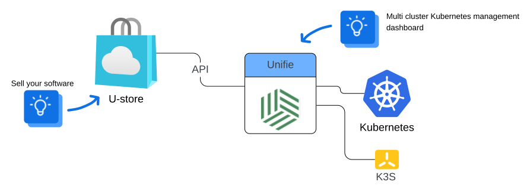

<picture>
  <source media="(prefers-color-scheme: dark)" srcset="https://avatars.githubusercontent.com/u/164479931?s=256&v=4">
  <source media="(prefers-color-scheme: light)" srcset="https://avatars.githubusercontent.com/u/164479931?s=256&v=4">
  
</picture>

# ⭐ U-store - cloud SaaS store template

    
    
    
     

U-Store — a powerful cloud SaaS store template designed to help startups quickly launch scalable platforms.

It features:

- Simplest way to get SaaS cloud for your software in 1 - 2 days.
- NoCode - does not require programming skills
- Allow to build cloud SaaS platform for any software to drive more usage, unlock more revenue and grow faster.
- Fully customizable UI and logic
- Hosted in your servers
- Stripe integration
- [See full features list ...](https://github.com/unifie-cloud/u-store?tab=readme-ov-file#-features)

Please star ⭐ the repo if you want us to continue with unifie-store! 😀

# 👋 Overview

- [UI](https://github.com/unifie-cloud/u-store?tab=readme-ov-file#-ui)
- [How it works](https://github.com/unifie-cloud/u-store?tab=readme-ov-file#-how-it-works)
- [Kubernetes deploy](https://github.com/unifie-cloud/u-store?tab=readme-ov-file#%EF%B8%8F-kubernetes-deploy)
- [Customization & Development](https://github.com/unifie-cloud/u-store?tab=readme-ov-file#-customization--development)
- [Features](https://github.com/unifie-cloud/u-store?tab=readme-ov-file#-features)
- [Community](https://github.com/unifie-cloud/u-store?tab=readme-ov-file#-community)
- [License](https://github.com/unifie-cloud/u-store?tab=readme-ov-file#%EF%B8%8F-license)

# 💡 UI

- [Demo store](https://demo-store.unifie.io)
- Login: `demo@demo-store.unifie.io`
- Password: `demo@demo-store.unifie.io`
- Stripe works in testing mode, use [testing card](https://docs.stripe.com/testing) number `4242424242424242` with CVC `111`
- [Full youtube presentation](https://youtu.be/O2SMceQucJg)

## 🎦 Video presentation 

- [Full youtube presentation 📽️](https://youtu.be/O2SMceQucJg)
 
[Ustore-demo.webm](https://github.com/user-attachments/assets/809685e2-17a7-4d02-800b-e3f36290cb2f)

# 💡 How it works

- U-store is cloud SaaS platform that allows to your customers to run your software in your kubernetes clusters over the world.
- [Unifie.cloud](https://www.unifie.cloud/doc/docs/Overview/) is multi cluster kubernetes management dashboard
- U-store use [Unifie.cloud API](https://www.unifie.cloud/doc/docs/api-v1/) to manage deployments in your kubernetes clusters.
- Your customers will see only U-store.
- Your DevOps team can use unifie.cloud as management dashboard for monitoring and debugging.

# 🌥️ Kubernetes deploy

- [AWS ECR image registry](https://gallery.ecr.aws/g4a0y2u8/unifie-store)
- [HELM chart](https://artifacthub.io/packages/helm/unifie/u-store)
- [Unifie.cloud one-click-deploy](https://unifie.cloud/kubernetes/unifie-project-lf24rvjgzu9rwhd5)

# ✨ Customization & Development

Development documentation:

- [Environment Variables](https://github.com/unifie-cloud/u-store/blob/staging/docs/EnvironmentVariables.md)
- [Built With](https://github.com/unifie-cloud/u-store/tree/staging/packages/store#%EF%B8%8F-built-with)
- [Local development](https://github.com/unifie-cloud/u-store/tree/staging/packages/store#-u-store-customization--development)

# 🥇 Features

- **Manage your software in you Kubernetes clusters**
- Simplest way to get SaaS cloud for your software in 1 - 2 days.
- Allow to build cloud SaaS platform for any software to drive more usage, unlock more revenue and grow faster.
- Fully customizable UI and logic
- Hosted in your servers
- Billing
- Create account
- Sign in with Email and Password
- Sign in with Magic Link
- Sign in with SAML SSO
- Sign in with Google [[Setting up Google OAuth](https://support.google.com/cloud/answer/6158849?hl=en)]
- Sign in with GitHub [[Creating a Github OAuth App](https://docs.github.com/en/developers/apps/building-oauth-apps/creating-an-oauth-app)]
- Directory Sync (SCIM)
- Update account
- Create team
- Delete team
- Invite users to the team
- Manage team members
- Update team settings
- Webhooks & Events
- Internationalization
- Audit logs
- Roles and Permissions
- Dark mode
- Email notifications
- E2E tests
- Docker compose
- Prisma Studio
- Update member role
- Directory Sync Events
- Avatar Upload
- SAML SSO
- Audit Log
- Webhook
- Payments
- Security Headers

# 🤩 Community

- [Discord](https://discord.gg/pqwhY5MQZ9) (Discord)
- [Discussions](https://github.com/unifie-cloud/u-store/discussions) (Discussions)
- [GitHub Issues](https://github.com/unifie-cloud/u-store/issues) (Contributions, report issues, and product ideas)
- [Project page](https://github.com/orgs/unifie-cloud/projects/2/views/1)
- [Contributing guide](https://github.com/unifie-cloud/u-store/blob/main/CONTRIBUTING.md)

# 🛡️ License

[Apache 2.0 License](https://github.com/unifie-cloud/u-store/blob/main/LICENSE)
