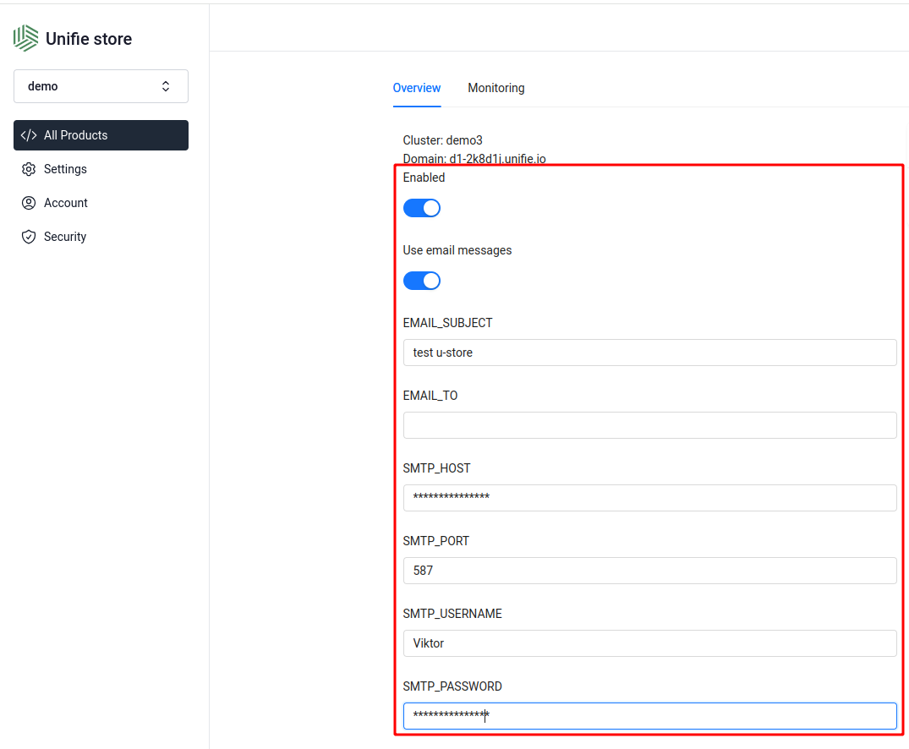

# Schema.json file

Allow to define options that can be changed by user from `products` page with graphql mutation `uStore_updateApplication`



Example:

```json
{
  "schema": {
    "properties": [
      {
        "type": "boolean",
        "label": "unifie-app-enabled",
        "name": "isEnabled"
      },
      {
        "type": "textarea",
        "label": "Config (yaml)",
        "name": "vars['versus-incident'].app.config"
      },
      {
        "type": "textarea",
        "label": "email_message (tpl)",
        "name": "vars['versus-incident'].app.email_message"
      }
    ]
  }
}
```

- type - input type. You can add your own input types in file `packages/store/components/unifie/UnifieForm.tsx`
- label - text message for user
- name - related field in unifie deployment configuration.

# Deployment configuration fields

You can edit this fields:

- name: String
- domain: String
- extData: JSON - your custom json data, can be used in helm as a vars
- isReady: Boolean
- isEnabled: Boolean
- region: Int - cluster id
- version: Int - version id (related to [CI/CD and Versions](https://www.unifie.cloud/doc/home/User-Guide/CI-CD/) )
- env: JSON [docs](https://www.unifie.cloud/doc/home/User-Guide/Environment-variables/)
- services: JSON [docs](https://www.unifie.cloud/doc/home/User-Guide/Unifie-Service-Types/)
- tags: JSON
- vars: JSON - helm vars (same as values.yaml) [read more](https://www.unifie.cloud/doc/home/User-Guide/Variables/)
